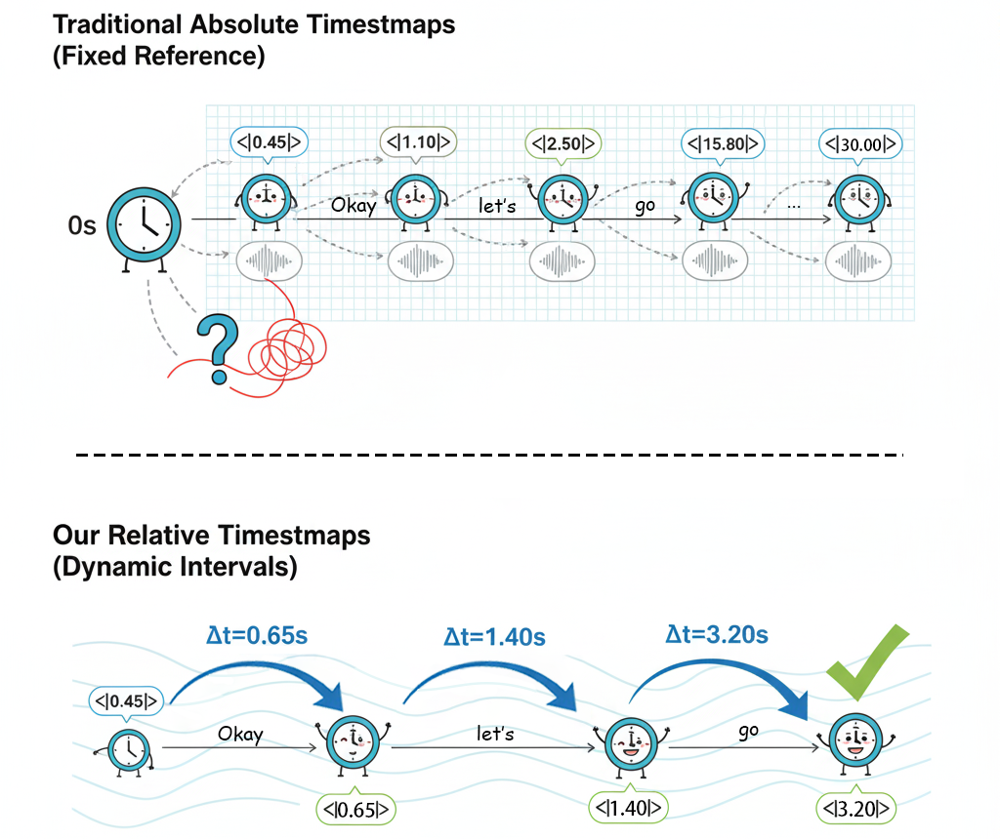

# Relative Time Intervals Representation for Word-Level Timestamping with Masked Training

This repository is the office implements for the paper: 
Relative Time Intervals Representation for Word-Level Timestamping with Masked Training

## The rest code will be updated after the paper is accepted.

## [Github Pages Here](https://quanwei.fun/Timestamp-Aware-Speech-LLM/)